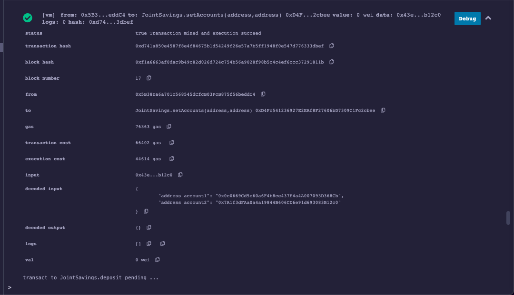
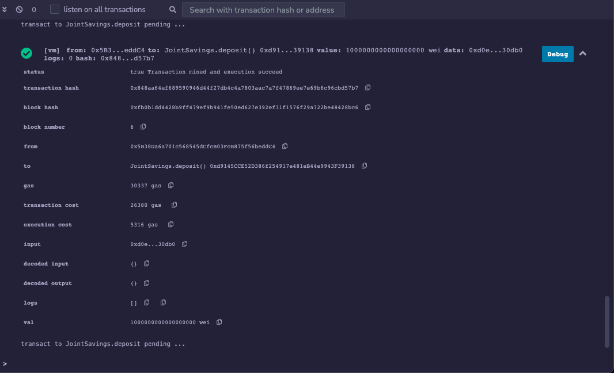
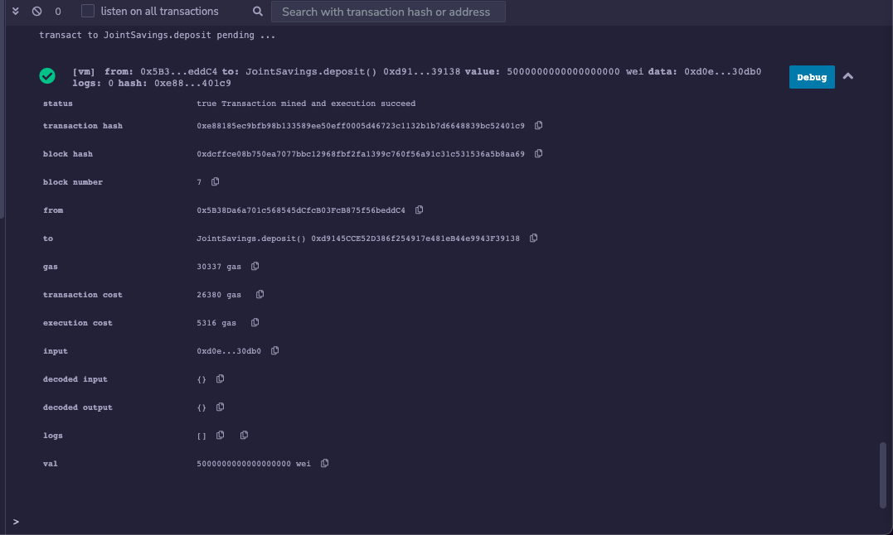
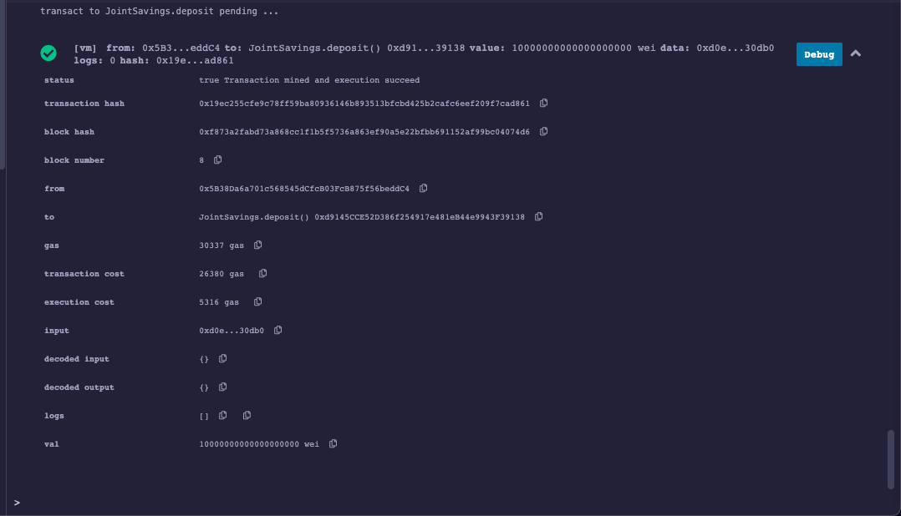
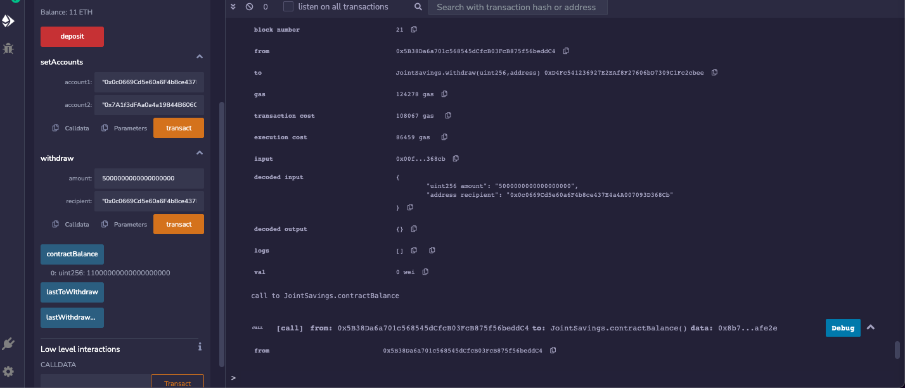
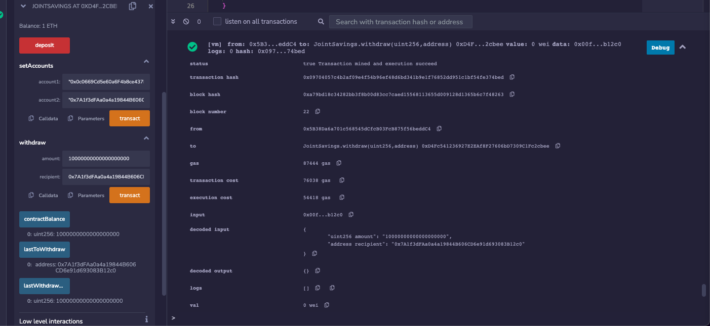

# "Joint Savings Account"

### Objective

Scenario: A fintech company is disrupting the finance industry with its own cross-border, Ethereum-compatible blockchain that connects financial institutions, by building smart contracts to automate many of the institutions’ financial processes and features, such as hosting joint savings accounts.

Our objective is to automate the creation of joint savings accounts by creating a __Solidity smart contract__ that accepts two user addresses. These addresses will be able to control a joint savings account. This smart contract will use ether management functions to implement a financial institution’s requirements for providing the features of the joint savings account. These features will consist of the ability to deposit and withdraw funds from the account.

### Result

> Below image shows successful implementation of 'SetAccount' function to define the authorized Ethereum address

> Successfull deposit of 1,5 & 10 Ethers (as wei) into the recepient's account

>Successful withdrawal of 5 & 10 Ethers from each recepient's account

